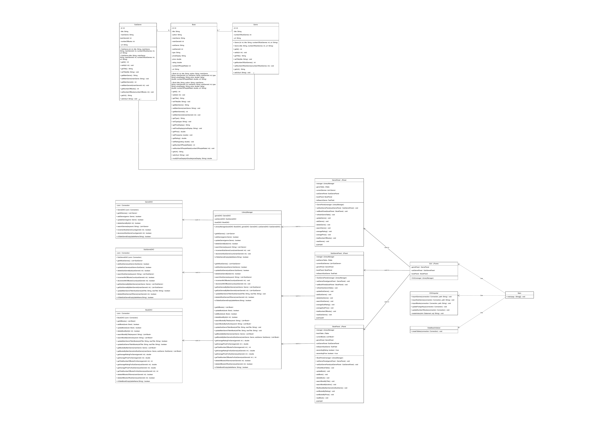

# Library Manager

A Java desktop application for managing a library's book catalog, developed as an
individual coursework project for **ECE318: Programming Principles for Engineers**.
The application allows an administrator to browse, search, filter, sort, and manage
a large book catalog through a Swing GUI backed by a MySQL database.

## Overview
The app manages three interconnected entities — **Genres**, **Sub-Genres**, and
**Books** — imported from the [Amazon Books Dataset](https://www.kaggle.com) (Kaggle),
split across three CSV files. Each main genre maps to multiple sub-genres, and each
book belongs to one main genre and one sub-genre.

## Class Diagram


## Features
**Books**
- Full CRUD (create, read, update, delete)
- Search by title or author
- Filter by main genre, then by sub-genre
- Sort by rating or price (ascending/descending)
- Export the book list (full or filtered/sorted subset) as a report

**Genres & Sub-Genres**
- Full CRUD for both main genres and sub-genres
- Search by keyword
- Automatic calculations: total number of books, average rating, average price
- Export reports including these calculations

**General**
- Error handling with user-friendly messages on all CRUD operations
- Handles a large dataset (~78,000 books) with good search/sort performance

## Architecture
The project follows a classic 3-layer architecture:

```
GUI (Swing panels)
   ↓
LibraryManager (business logic)
   ↓
DAO layer (BookDAO, GenreDAO, SubGenreDAO)
   ↓
MySQL Database
```

- `Book`, `Genre`, `SubGenre` — model classes
- `BookDAO`, `GenreDAO`, `SubGenreDAO` — data access layer (JDBC)
- `LibraryManager` — business logic, delegates to the DAO layer
- `GUI`, `GenrePanel`, `SubGenrePanel`, `BookPanel` — Swing interface
- `CsvImporter` — imports genres/sub-genres/books from CSV and links foreign keys
- `DatabaseInitializer` — creates tables and indexes on first run

## Tech Stack
- Java (Maven project)
- Swing (GUI)
- JDBC + MySQL
- OpenCSV (CSV parsing)

## Dataset
Located in `data/`:
- `Genre_df.csv` — 35 main genres
- `Sub_Genre_df.csv` — 329 sub-genres
- `Books_df.csv` — ~78,000 books

## Setup & Run

1. Make sure a local MySQL server is running, and create the database:
```sql
CREATE DATABASE library;
```

2. Set your database credentials as environment variables (never hardcode them):
```
DB_URL=jdbc:mysql://localhost:3306/library
DB_USER=root
DB_PASSWORD=your_password
```

3. Build and run:
```bash
mvn clean install
```
Then run the `Main` class — it will create tables, import the CSV data from `data/`,
and open the GUI.

## Author
Lilou Parrin — Data Science & AI student at ESIEE Paris (individual project)
